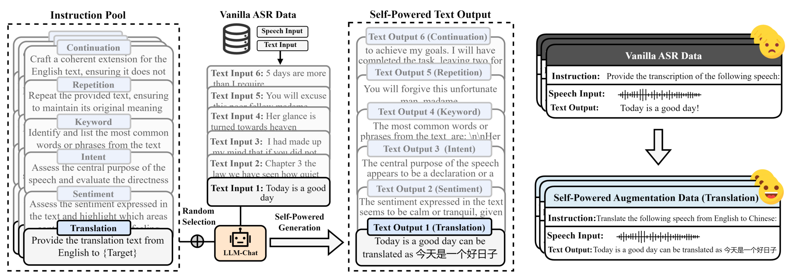
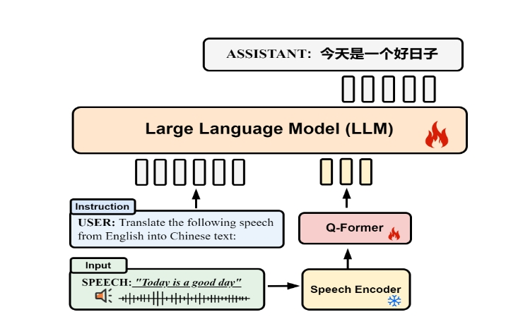

# Self-Powered LLM Modality Expansion for Large Speech-Text Models

<div align="center">
  
</div>


<div align="center">
<a href='https://github.com/ytf-philp/Self-powered-LSM'></a>  <a href=''> </a>  <a href='https://huggingface.co/tsinghua-ee/SALMONN'></a> 
</div>

<div align="center">
Tengfei Yu, Xuebo Liu, Zhiyi Hou, Liang Ding, Dacheng Tao, Min Zhang
</div>

## 👀 Overview

**Self-Powered LSM** is a pioneering Large Speech-Text Model that utilizes self-generated data to boost the speech capabilities of Large Language Models. Self-Powered data is generated by prompting the LLM with instructions alongside the text from the vanilla ASR dataset. 

<div align="left">
  
</div>


## 🔥 News
- [2024-09-23] 🎁 We have released **Self-Powered LSM** with whisper-large as encoder and vicuna-7B-v1.5 as LLM at [tsinghua-ee/SALMONN-7B](https://huggingface.co/tsinghua-ee/SALMONN-7B) and built the 7B demo [here](https://huggingface.co/spaces/tsinghua-ee/SALMONN-7B-gradio)!
- [2024-08-20] 🤖 Release of all necessary code for training your own Self-Powered LSM!


## 🌈Speech Instructional Dataset

We use Vicuna as the backbone LLM to generate the dataset. To utilize our dataset, download LibriSpeech-960, Common Voice 4.0, and GigaSpeech-L, and place them in the `/data` directory.


The data is organized as follows:
```
data
|- new_aug ## place the speech instructional dataset self-power generated
    |- translation
    |- repeat
    ...
    |- combine.py
    |- train_data.jsonl ## combine and shuffle all the generated data for training
|- process ## place the tokenized training dataset
|- Librispeech
    |- train-clean-100
    |- train-clean-360
    |- train-other-500
|- giga_all
    |-l
    |-m
    |...
|- en_new
    |-clips
|- data.jsonl    ## all the asr file, including audio path and its transcription
```

Example for data.jsonl:

```json
{"audio": "self-powered/data/LibriSpeech/train-clean-360/303/123506/303-123506-0041.flac", "text": "Her skin was of a light reddish copper color against which the crimson glow of her cheeks and the ruby of her beautifully molded lips shone with a strangely enhancing effect. She was as destitute of clothes as the green Martians who accompanied her."}
{"audio": "self-powered/data/giga_all/l/l_chunks_0032/POD0000003438_S0000130.wav", "text": "Why would you ask me that? Of course I want that."}
{"audio": "self-powered/data/giga_all/l/l_chunks_0018/AUD0000001575_S0002840.wav", "text": "But whose language is similar to the languages of America?"}
```

To obtain the speech instructional dataset to train the model. You can find the JSONL file [here](https://drive.google.com/file/d/1vrq9hA5dSLEv-_6Qm9kzHdbrxGjIXlng/view).
Additionally, you can generate your own self-powered data:

For translation task as the example
 ```
cd src/data_process

python asr_text_generation_unified_translation.py --manifest raw_data_example/example.jsonl --cate translation --start 0 --nshard 4 --rank 0

-- manifest: The JSON file of ASR data, containing audio paths and their transcriptions.
-- cate: Generation type.
-- start: The starting line number to read.
-- nshard: Number of parallel shards.
-- rank: Shard number.
 ```


Example for train_data.jsonl:
```json
{"instruction": "Extract significant words or phrases that appear often in the text, exclude basic stopwords, to uncover the main subjects", "audio": "self-powered/data/LibriSpeech/train-clean-100/1963/142776/1963-142776-0017.flac", "text": "Heat, soup, serve, time."}
{"instruction": "Paraphrase the provided text while preserving all original facts and nuances", "audio": "self-powered/data/LibriSpeech/train-other-500/7147/80028/7147-80028-0085.flac", "text": "Adelaide Houghton would be aware of the situation and would certainly congratulate him. It is important to note that there could never be a marriage between them, as it would be out of the question."}
{"instruction": "Develop a consistent and attractive continuation of the English text, keeping it under 50 words", "audio": "self-powered/data/LibriSpeech/train-other-500/8414/284675/8414-284675-0029.flac", "text": "\"Yes, that's right,\" Benny replied. \"A long time ago, Henry rolled his brother over on the pine needles, and Violet forgot to ring the bell. We had to hold them with leaves.\""}

```
## 🌟 Train Self-Powered LSM

The model architecture of the Self-Powered LSM is depicted as follows: We use the encoder component of Whisper as the speech encoder and employ Vicuna-7B-1.5 as the large language model. 
Q-Former, serving as the connection module. The output sequence, integrated with the text instruction, is then fed into the LLM to generate the text response.

<div align=left></div>

To train the model, you should download whipser and vicuna first and palace it into `/model`
The model folder is organized as follows:
```
model
|- whisper-large-v2
|- vicuna-7b-v1.5
|- whisper_large_7B
|- output_model
    |- xxx
    |- xxx
|- model.py    ## combine whisper encoder and vicuna as LSM
```

**Preprocessing Data**

* Tokenize training dataset 
```
python src/data_process/self-powered/src/speech_text_paired_dataset.py \
    --dataroot data/process \
    --manifest_files train_data \
    --lm_path model/vicuna-7b-v1.5 \
    --data_files data/new_aug/train_data.json \
    --num_proc 16 \
```

**Training**
* To train the model, you may run:
```
bash self-powered/scripts/vicuna_large_sft.sh
```

**Evaluation**

you can evaluate the model with batchsize, for asr as a example
* Tokenize the evaluation dataset
```
python ./self-powered/src/evaluate_token_asr.py
``` 
* Inference
```
bash self-powered/scripts/inference_ASR.sh $DATA $MODEL $SAVE_PATH
``` 


## 🚀 License Agreement

Researchers and developers are welcome to utilize our code for both academic and commercial purposes. Our models leverage the LLaMA-2 and Whisper architectures. We kindly ask that all users adhere to the MIT License for Whisper and the specific licensing requirements for LLaMA-2
<br>

## Citation

If you find our paper and code useful in your research, please consider giving a star :star: and citation :pencil: :)

```BibTeX
```
<br>

## Contact Us

If you have any questions related to the code or the paper, feel free to email Tengfei Yu (921692739@qq.com).
